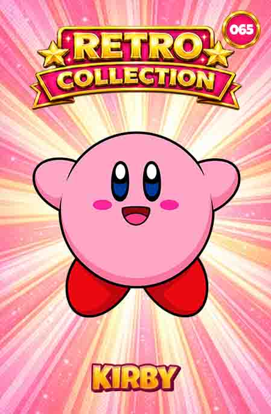
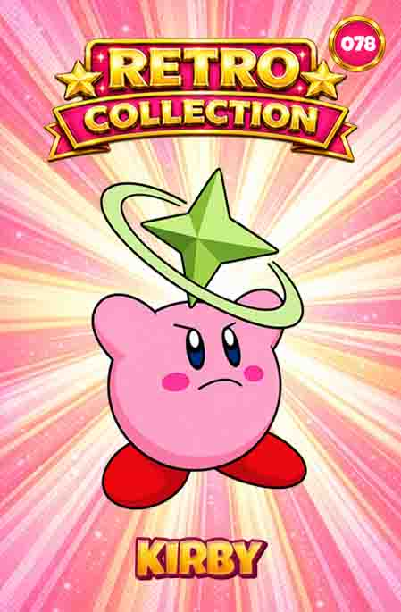

# 🎴 Retro Collection

A collectible card project inspired by the promotional collectibles, tazos and licensed merchandise that became popular during the 1990s.

The goal of this project is to design, document and preserve original collectible card collections based on classic games and retro culture.

| # 017 | # 027 | # 065 | # 078 |
|------|------|------|------|
|  |  |  |  |

---

## Project Status

| Collection | Season | Cards | Status |
|------------|---------|--------|---------|
| Super Mario Bros | 00 | 64 | ✅ Complete |
| Kirby 64: The Crystal Shards | 01 | 146 | Em Desenvolvimento |

---

## Collections

### Season 00 — Super Mario Bros

Inspired by the original Super Mario Bros universe.

- Total Cards: 64
- Status: Complete
- Physical Version: Produced

📂 Collection:

[Season 00 — Super Mario Bros](collections/season-00-super-mario-bros)


### 🌟 Season 01 — Kirby 64: The Crystal Shards
Status: In Development

---

## Project Structure

```text
Retro Collection/

├── collections/
├── docs/
├── README.md
└── .gitignore
```

---

## Design Philosophy

- Retro aesthetics
- Physical collectible format
- Print-ready production
- Consistent numbering system
- Collection-focused design

---

## Roadmap

### Completed

- [x] Season 00 — Super Mario Bros

### Planned

- [ ] Season 01 - Kirby 64: The Crystal Shards | Em Desenvolvimento |
- [ ] Cards Holders

---

Retro Collection © 2026