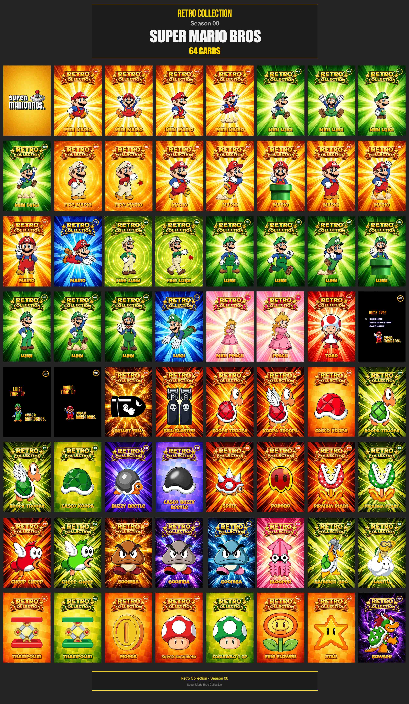
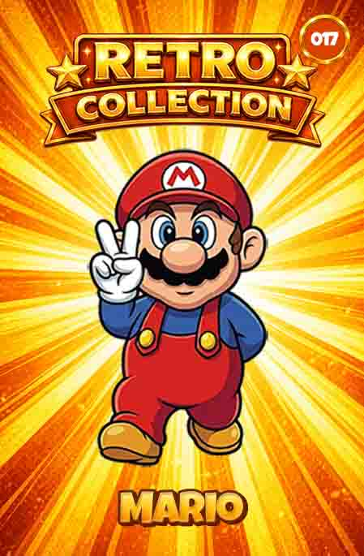
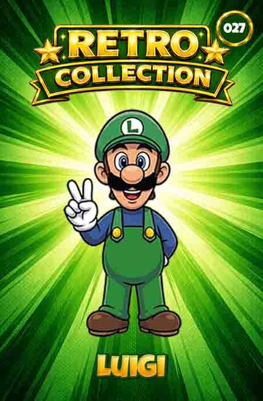
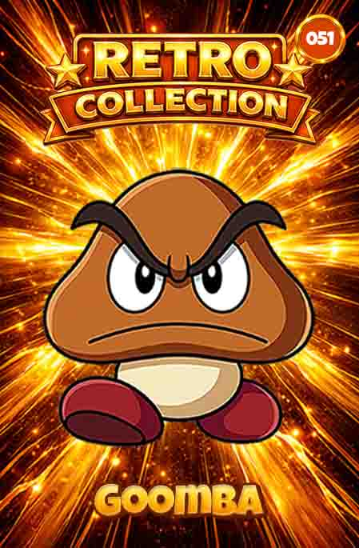
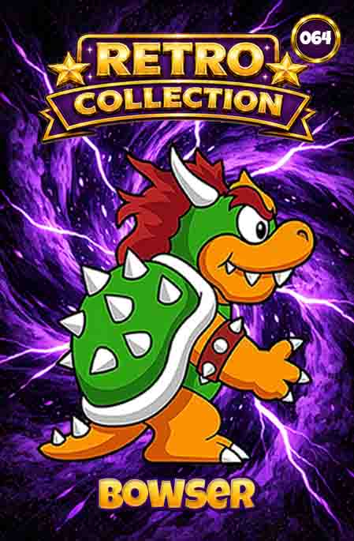

# 🍄 Season 00 — Super Mario Bros

## Collection Overview



---

## About

Season 00 is the inaugural collection of the **Retro Collection Project**.

Inspired by the collectible tazos and promotional cards popular during the 1990s, this set recreates the world of **Super Mario Bros** through a complete collection of 64 collectible cards designed for physical printing and collecting.

---

## Collection Information

| Property | Value |
|-----------|-----------|
| Collection | Super Mario Bros |
| Season | 00 |
| Status | Complete |
| Total Cards | 64 |
| Card Size | 4 cm × 6 cm |
| Resolution | 300 DPI |
| Format | Physical Collectible Cards |
| Numbering | 001–064 |
| Platform | NES |
| Release Year | 1983 |
---

## Design Features

- Retro-inspired collectible card design
- Frame visual system
- Sequential card numbering
- Print-ready format
- Consistent visual identity
- Inspired by 1990s promotional collectibles

---


## Featured Cards

| # 017 | # 027 | # 051 | # 064 |
|------|------|------|------|
|  |  |  |  |

----

## Documentation

### Collection Specification

Detailed technical information:

- [Collection Specification](collection-specification.md)

### Card Index

Complete catalog of all cards:

- [Card Index](card-index.md)

---

## Repository Structure

```text
season-00-super-mario-bros/

├── cards/
├── previews/
├── card-index.md
├── collection-specification.md
└── README.md
```

---

## Status

- [x] Collection Completed
- [x] Printed Version Produced
- [x] Documentation Avaliable

---

## Retro Collection

Season 00 is part of the Retro Collection Project, a series of collectible card collections inspired by classic games, retro culture and promotional collectibles from the 1990s.

---

*Retro Collection © 2026*