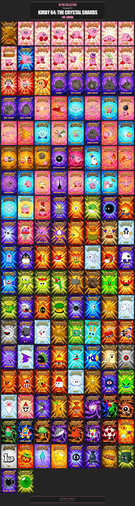
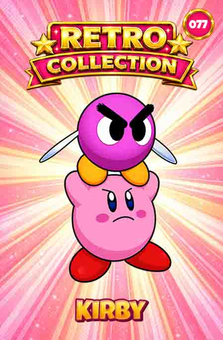
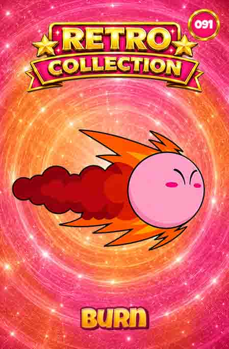
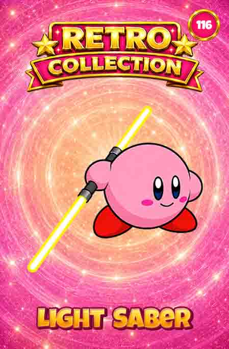

# 🌟 Season 01 — Kirby 64: The Crystal Shards

## Status

🚧 In Development

---

## Collection Overview



---

## About

Season 01 is the second collection of the Retro Collection project.

Based on Kirby 64: The Crystal Shards, this collection aims to capture the characters, enemies, bosses, abilities, and memorable moments from the Nintendo 64 classic while following the visual standards established during Season 00.

---

## Collection Information

| Property | Value |
|-----------|-----------|
| Collection | Kirby 64: The Crystal Shards |
| Season | 01 |
| Status | In Development |
| Total Cards | 146 |
| Card Size | 4 cm × 6 cm |
| Resolution | 300 DPI |
| Format | Physical Collectible Cards |
| Numbering | 065–210 |
| Platform | Nintendo 64 |
| Release Year | 2000 |

---

## Design Features

- Retro-inspired collectible card design
- Frame visual system
- Sequential card numbering
- Print-ready format
- Consistent visual identity
- Inspired by 1990s promotional collectibles

---

## Featured Cards

| # 065 | # 077 | # 091 | # 116 |
|------|------|------|------|
|  |  |  |  |

---

## Documentation

### Collection Specification

Detailed technical information:

- [Collection Specification](collections-specification.md)

### Card Index

Complete catalog of all cards:

- [Card Index](card-index.md)

---

## Repository Structure

```text
season-01-kirby-64/

├── cards/
├── previews/
├── raws/
├── card-index.md
├── collection-specification.md
└── README.md
```

---


## Status

- [x] Collection Completed
- [ ] Printed Version Produced
- [ ] Documentation Avaliable

---

## Retro Collection

Season 01 is part of the Retro Collection Project, a series of collectible card collections inspired by classic games, retro culture and promotional collectibles from the 1990s.

---

*Retro Collection © 2026*